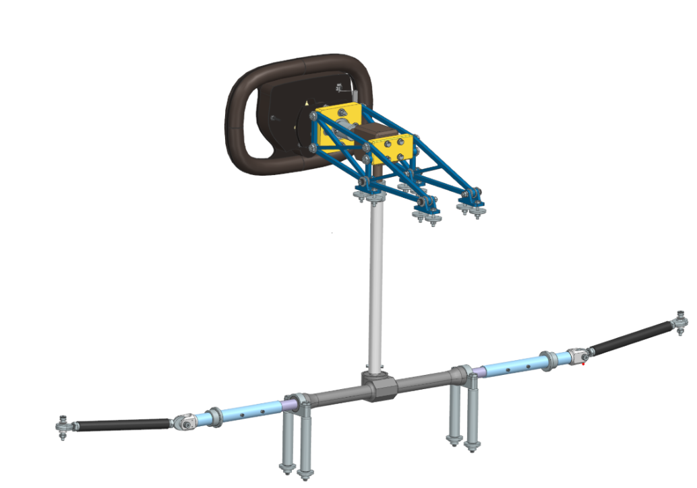
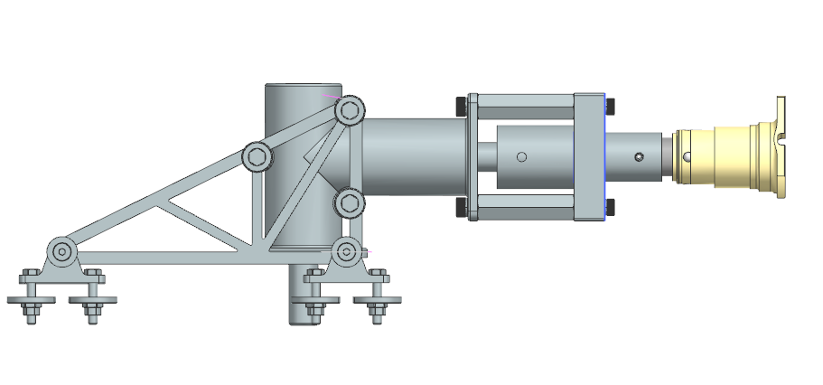
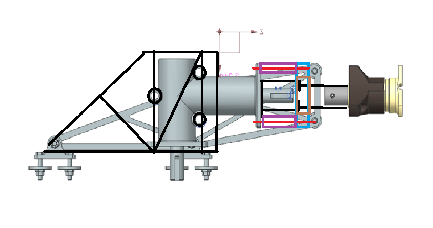
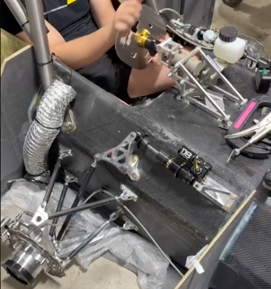

# Purdue Solar Racing Steering Assembly
Goal: Redesign the upper and lower steering assembly made by the former Steering Design Lead to account for a new gearbox

Issues:
* Current gearbox no longer available for purchase
* Assembly extended into driver space making egress difficult
* Trusses have a safety factor of less than one under normal loads
* Lower column shaft should be nested within rack and pinion connector to distribute sheer force from spring pin more effectively

*Initial Upper Column Design*

Solved Issues:
* Safety factor now over 1
* Gearbox changed to one that's readily available

Problems:
* Shaft coupler was still too long; interfered with drivers ability to enter and exit the car
* Shaft Coupler had no way to prevent the steering wheel from being pushed inward

Solutions:
* Rotated the gearbox 90 degrees to give drivers extra space since that part of the gearbox is shorter 
* Added a hard point nested inside of the coupler to prevent movement

New design drawing following feedback from seniors
* Black (left): New truss design
* Black(right): Gearbox/Steering wheel shaft coupler
* Red: Mounting hardware
* Purple: Spacers
* Brown: Bearing
* Blue: Bearing block

*Side view of the Upper Steering Assembly in Siemen's NX*

*3D view of the upper and lower Steering Assembly in Siemen's NX*

Solved Issues:
* Assembly shortened to aid in driver egress
* Lower column shaft to be nested within rack and pinion connector
* Trusses redesigned to account for new gearbox orientation

Remaining Issues
* Assembly collision in lower shaft coupler in CAD
* Object linking issues with the truss and mounting brackets

Pros
* All steering parts were manufactured on time for competition
* No major issues reported during assembly or manufacturing

Semi-Final Product:

Plans to fix remaining issues:
* Develop better wave linking strategies to prevent truss geometry issues
* Remove collision in lower steering column

* Lessons learned for the next car:
    * Ensure mounting spaces on the chassis are made to fit steering components to remove the need for spacers between the gearbox and trusses
    * Make sure all parts are easy to order to prevent last minute changes
    * Better team organization to ensure manufacturing deadlines are met through consistent meetings and new member inclusion
    * Account for lower safety factors earlier in the design process to prevent last minute changes
    * Create thorough documentation of all design decisions so team members and leads have more guidance going into the steering design and manufacturing processes

